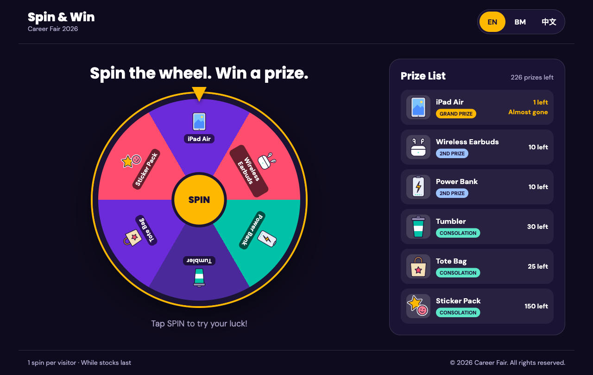

# Spin & Win

A spin-the-wheel prize game for a job fair booth. A visitor taps **SPIN**, the wheel stops on a prize, and a winner screen with confetti tells them to collect the prize at the counter.



## Features

- **Different chances per prize:** each prize has its own chance of being won, so big prizes are rare.
- **Prize stock:** the prize list shows how many of each prize are left. When a prize runs out, it is removed from the wheel. The stock is saved, so refreshing the page doesn't reset it.
- **Three languages:** English, Bahasa Melayu and 中文. Switch with the buttons at the top right.
- **Different win effects:** grand, second and consolation prizes each get their own headline, colours and confetti.
- **Easy to change:** prizes and colours are set in one JSON file. No code changes needed.

## Tech stack

- [React 19](https://react.dev) + [TypeScript](https://www.typescriptlang.org)
- [Vite](https://vite.dev) to run and build the app
- [i18next](https://www.i18next.com) / [react-i18next](https://react.i18next.com) for translations
- [canvas-confetti](https://github.com/catdad/canvas-confetti) for the confetti

## Prerequisites

- [Node.js](https://nodejs.org) 22 or later
- [pnpm](https://pnpm.io) 10 or later

## Getting started

```bash
git clone https://github.com/SheldonFam/job-fair-spinning-wheel-game.git
cd job-fair-spinning-wheel-game
pnpm install    # install packages
pnpm dev        # run the app locally, then open the link it prints
```

Other commands:

```bash
pnpm build      # check for errors and build the site into dist/
pnpm preview    # run the built site locally
pnpm lint       # check code style
```

## Setting up prizes

All prizes and colours are in [`public/data/prizes.json`](public/data/prizes.json). The app reads this file every time the page opens.

```json
{
  "event": { "title": "Spin & Win" },
  "theme": {
    "gold": "#FFB800",
    "sliceColors": ["#6C2BD9", "#FF4D6D", "#00C2A8", "#4A2A9A"]
  },
  "prizes": [
    {
      "id": "p1",
      "name": "iPad Air",
      "tier": "grand",
      "quantity": 1,
      "probability": 0.02,
      "image": "/prizes/ipad.png"
    }
  ]
}
```

| Field | What it does |
| --- | --- |
| `event.title` | Title at the top of the page. |
| `theme.gold` | Main highlight colour: wheel border, pointer, SPIN button and more. |
| `theme.sliceColors` | Colours of the wheel slices. They repeat if there are more prizes than colours. |
| `prizes[].id` | A unique ID for the prize, e.g. `p1`. Also used to look up the prize's translated name. |
| `prizes[].name` | Prize name. Shown when there's no translation for it. |
| `prizes[].tier` | `grand`, `second` or `consolation`. Decides the win effect. |
| `prizes[].quantity` | How many of this prize you have. |
| `prizes[].probability` | Chance of winning this prize. Bigger number = more likely. The numbers don't need to add up to 1. |
| `prizes[].image` | Prize picture. `/prizes/ipad.png` means the file `public/prizes/ipad.png`. |

Put prize pictures in [`public/prizes/`](public/prizes/).

> **Changed `prizes.json` but nothing happened?** Once someone has won a prize, the game uses its saved stock instead of the file. Clear the saved stock (see [Resetting the stock](#resetting-the-stock)) to load your changes.

### How prize data works

1. **Stored in a file:** `public/data/prizes.json` has every prize's name, tier, quantity, chance and picture, plus the colours.
2. **Loaded:** `App.tsx` reads the file when the page opens.
3. **Checked:** `src/types.ts` describes what the data should look like, so mistakes in the code show up as errors when building.
4. **Used:**
   - The wheel shows one slice for each prize that is still in stock.
   - `src/lib/pickPrize.ts` picks the winner using each prize's `probability`.
   - The prize list shows how many are left.
   - The colours are applied to the page.
5. **Updated:** each win takes 1 off that prize's `quantity`. At 0, the prize is removed from the wheel.
6. **Saved:** the updated list is saved in the browser (`localStorage`), so it stays after a refresh.

There is no database. The game runs on one device at the booth, so a JSON file plus browser storage is enough. A database would only be needed if several devices had to share the same stock.

### Resetting the stock

The saved stock stays until you clear it. To start again with the numbers in `prizes.json`:

1. Press **F12** to open the browser's developer tools and go to the **Console** tab.
2. Run:
   ```js
   localStorage.removeItem("prizes")
   ```
3. Reload the page.

The stock is saved separately in each browser and on each device.

## Translations

All text on the page is in [`src/locales/`](src/locales/): `en.json` (English), `ms.json` (Bahasa Melayu) and `zh.json` (中文).

Prize names are translated under `prizes`, using the prize's `id`. For example, in `ms.json`:

```json
{
  "prizes": {
    "p2": "Fon Telinga Tanpa Wayar"
  }
}
```

If a prize has no translation, its `name` from `prizes.json` is shown.

## Project structure

```
public/
  data/prizes.json     prize and colour settings
  prizes/              prize pictures
  favicon.svg          browser tab icon
src/
  components/          page parts: Header, Wheel, PrizeList, Modal (winner screen), Footer
  lib/pickPrize.ts     picks a random prize based on its chance
  lib/nextRotation.ts  works out how far to spin so the wheel stops on the winning prize
  locales/             translations (en / ms / zh)
  i18n.ts              translation setup
  types.ts             shape of the prize data
  App.tsx              loads the prizes, updates and saves the stock, shows the winner
  main.tsx             starts the app
docs/
  screenshot.png       screenshot used in this README
```
